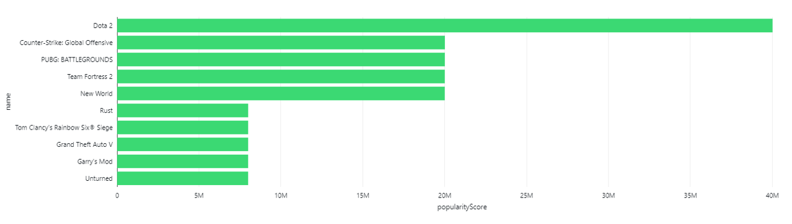
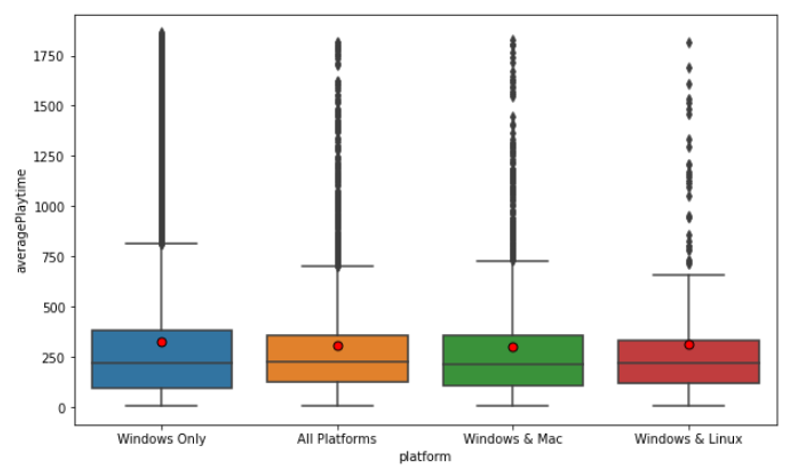
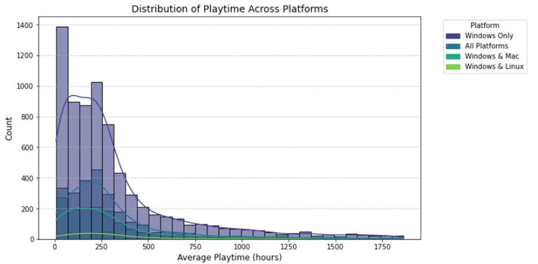
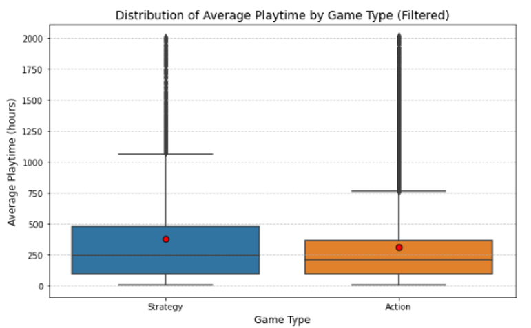
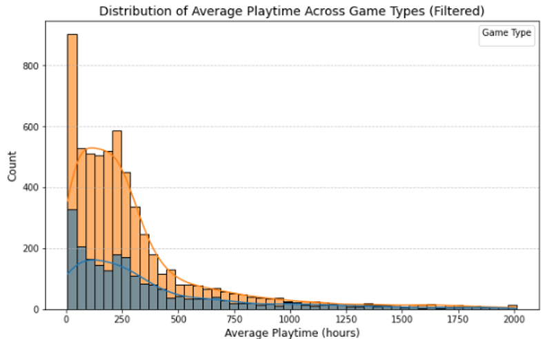
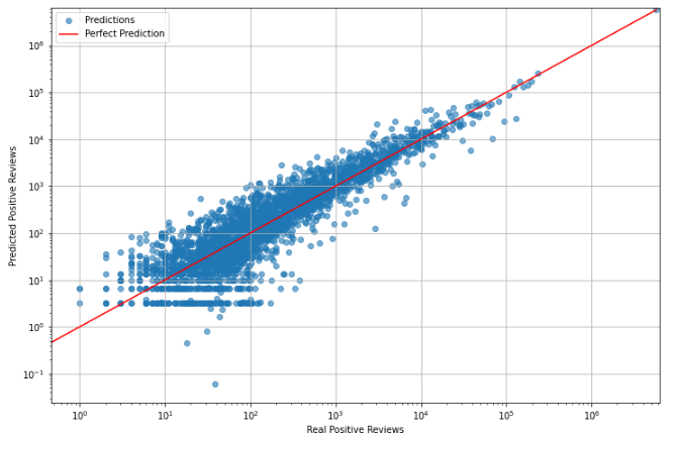

# Steam Games Analysis

# Overview

This project consist of two phases:  
1. Real-time data pipeline using Kafka Streams which processes and transfers data.  
Kafka Producer fetches data from a source and publishes it to a topic.  
Kafka Consumer subscribes to the topic and writes the received data to Parquet files.  
2. On Databricks, with Apache Spark data is loaded from Parquet and analyzed.

# Analysis

## Analysis 1 - Popularity Analysis
This analysis combines sentiment, playtime, and popularity metrics to rank Steam games.  

The sentiment analysis is performed to understand player sentiment based on positive and negative reviews. We calculate a sentimentScore as the difference between the positive and negative review counts. Games are then classified into three categories: 
- **Positive** (sentimentScore > 0)
- **Neutral** (sentimentScore == 0)
- **Negative** (sentimentScore < 0)

The popularity analysis ranks games based on ownership, user scores, and playtime. We extract numeric values from the estimatedOwners column, and then we calculate a popularityScore as a weighted sum of three factors: 40% estimatedOwnersNum, 30% userScore, and 30% totalPlaytime.  

### Why this analysis?
- Helps stakeholders understand what makes a game successful and supports data-driven decision-making.

### Results

## Analysis 2 - Welch ANOVA Test on Game Playtime Across Platforms
This analysis aims to determine whether the average playtime of games differs significantly across different platforms (Windows, Mac, Linux) using ANOVA (Analysis of Variance).  

Each game is categorized based on platform (games with zero price and zero playtime are removed to ensure meaningful comparisons).  

### Why Welch ANOVA?
ANOVA is used to test whether the mean average playtime differs across multiple platform groups. We are using Welch ANOVA because there are disbalance between samples
The F-statistic measures variance between groups relative to variance within groups and the p-value determines statistical significance (typically, p < 0.05 indicates a significant difference).

### Why this analysis?
- Helps determine whether games perform better on specific platforms in terms of playtime.
- If significant differences exist, it may indicate platform-specific issues affecting player retention.
- Understanding platform engagement trends helps in pricing games more effectively.
- Guides decisions on whether developing for multiple platforms improves engagement.

### Results
#### **Box Plot - Distribution of Average Playtime by Platform**  

This box plot compares the average playtime for different platforms, filtering out extreme outliers (5th–95th percentile).

#### Observations:  

- Windows-only and cross-platform games have a wider range of playtime.
- Median playtime is similar across platforms, but the spread and outliers vary significantly.

#### **Histogram - Distribution of Playtime Across Platforms**  

This histogram shows the distribution of average playtime for different platforms, with each platform's density curve overlaid.

#### Observations:  
- Most games have low playtime, with fewer games having very high playtime.
- Multiple peaks (multimodal distribution) suggests different groups of games with varying playtime patterns.
- Some platforms have higher densities in certain playtime ranges (e.g., Mac and Linux seem to have lower distributions).

## Analysis 3 - Mann-Whitney U Test on Game Playtime Across Genres
This analysis examines whether there is a statistically significant difference in average playtime between Action and Strategy games using the Mann-Whitney U test.  

Each game is categorized as Action or Strategy based on its genre information. Games with zero playtime are removed for better analysis.  

### Why the Mann-Whitney U Test?
The Mann-Whitney U test is a non-parametric test used to compare two independent groups when data is not normally distributed. Unlike the t-test, it does not assume equal variances and is suitable for comparing gameplay distributions across genres. The U-statistic measures how the ranked values of one group compare to the other, while the p-value determines statistical significance (typically, p < 0.05 indicates a significant difference).

### Why this analysis?
- Helps determine whether Action or Strategy games lead to longer play sessions.
- Understanding genre-based playtime trends helps developers and publishers optimize gameplay mechanics, marketing strategies, and monetization models.

### Results
#### **Box Plot - Distribution of Average Playtime by Game Type**  

This box plot compares the average playtime between Action and Strategy games, with extreme outliers filtered at the 5th and 95th percentiles.

#### Observations:  

- Action games have a lower median playtime compared to Strategy games, suggesting that Strategy players tend to engage in longer gaming sessions.
- The interquartile range (IQR) for Strategy games is wider, meaning that playtime among Strategy players varies significantly.

#### **Histogram - Distribution of Playtime Across Game Types**  

This histogram illustrates the frequency distribution of playtime for Action and Strategy games.

#### Observations:  

- Action games show a much higher peak at low playtime values, suggesting that many Action games engage players for shorter bursts rather than long sessions.
- Strategy games have a more evenly spread distribution, meaning that they tend to sustain player engagement for longer durations.
- Both distributions are right-skewed, meaning that most games have relatively low playtime, but a few games attract extremely dedicated players.

## Analysis 4 - Comparing Playtime for High and Low Metacritic Scores
This analysis provides insights into whether higher-rated games are more engaging, helping players to make choices about which games to play. Analysis uses a two-sample t-test to determine if there is a statistically significant difference in average playtime between games with high Metacritic scores (above 75) and those with low Metacritic scores (75 or below). The goal is to understand if higher-rated games tend to have longer player engagement, as measured by average playtime.  

The t-statistic is calculated to measure the difference in means relative to the variability in the data. The p-value is calculated using the t-distribution with the computed degrees of freedom. It represents the probability of observing the calculated t-statistic (or more extreme) under the null hypothesis.

### Hypothesis Testing
A significance level (α) of 0.05 is used to determine whether to reject the null hypothesis.
- **Null Hypothesis (H₀)**: There is no difference in average playtime between high and low Metacritic games.
- **Alternative Hypothesis (H₁)**: There is a significant difference in average playtime between high and low metacritic games.

### Results
The high t-statistic and the extremely small p-value indicate that higher-rated games tend to have significantly longer average playtime compared to lower-rated games.

### Why this analysis?
- Players can use this data to make informed choices about which games to invest their time in.
- If high Metacritic games lead to longer playtime, publishers can use this to market games as "long-lasting entertainment".

## Analysis 5 - Linear Regression on Game Reviews and Player Engagement
The goal is to build a predictive model using linear regression to understand which factors contribute most to the number of positive reviews a game receives.  

The dataset is initially randomly sampled to reduce its size for faster processing, retaining 10% of the original data. A linear regression model is trained to predict positive reviews based on:  
- **recommendations** (strongest correlation with positive reviews)
- **negative reviews** (popular games tend to have both high positive and high negative reviews)
- **peak concurrent users (peakCCU)** (indicating game popularity and visibility)

The performance of the linear regression model is evaluated using the following metrics:  
- **R² Score** - Measures how well the model explains the variance in positive reviews.
- **Mean Absolute Error (MAE)** - Average absolute difference between the predicted and actual values.
- **Mean Squared Error (MSE)** - Average squared difference between the predicted and actual values (giving more weight to larger errors).

### Why this analysis?
- Helps developers understand what drives positive reception - whether high peak player count or recommendations are stronger indicators of a game's success.
- Identifies trends in game popularity, useful for predicting the success of upcoming titles.
- Aids publishers in making marketing decisions (e.g. boosting visibility for highly recommended but under-reviewed games).
- Provides insight into user sentiment dynamics. Showing how negative reviews also correlate with game popularity.

### Results

